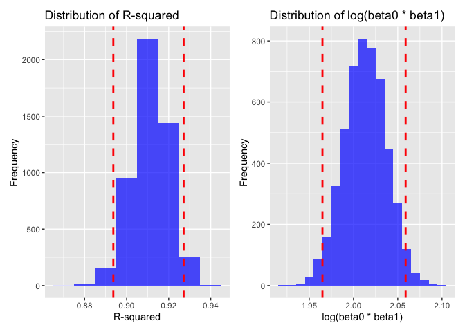

HW 6
================
Carolyn Martinez
2024-11-30

``` r
library(p8105.datasets)
library(tidyverse)
```

    ## ── Attaching core tidyverse packages ──────────────────────── tidyverse 2.0.0 ──
    ## ✔ dplyr     1.1.4     ✔ readr     2.1.5
    ## ✔ forcats   1.0.0     ✔ stringr   1.5.1
    ## ✔ ggplot2   3.5.1     ✔ tibble    3.2.1
    ## ✔ lubridate 1.9.3     ✔ tidyr     1.3.1
    ## ✔ purrr     1.0.2     
    ## ── Conflicts ────────────────────────────────────────── tidyverse_conflicts() ──
    ## ✖ dplyr::filter() masks stats::filter()
    ## ✖ dplyr::lag()    masks stats::lag()
    ## ℹ Use the conflicted package (<http://conflicted.r-lib.org/>) to force all conflicts to become errors

``` r
library(dplyr)
library(patchwork)
set.seed(1)
```

## Problem 1:Weather Data

``` r
weather_df = 
  rnoaa::meteo_pull_monitors(
    c("USW00094728"),
    var = c("PRCP", "TMIN", "TMAX"), 
    date_min = "2017-01-01",
    date_max = "2017-12-31") %>%
  mutate(
    name = recode(id, USW00094728 = "CentralPark_NY"),
    tmin = tmin / 10,
    tmax = tmax / 10) %>%
  select(name, id, everything())
```

    ## using cached file: /Users/carolynmartinez/Library/Caches/org.R-project.R/R/rnoaa/noaa_ghcnd/USW00094728.dly

    ## date created (size, mb): 2024-09-26 10:20:15.837988 (8.651)

    ## file min/max dates: 1869-01-01 / 2024-09-30

``` r
boot_sample = function(df) {
  sample_frac(df, replace = TRUE)
}

boot_straps = 
  tibble(strap_number = 1:5000) |> 
  mutate(
    strap_sample = map(strap_number, \(i) boot_sample(df = weather_df))
  )

bootstrap_results = 
  boot_straps |> 
  mutate(
    models = map(strap_sample, \(df) lm(tmax ~ tmin, data = df)),
    results = map(models, \(model) {
      r_squared = broom::glance(model)$r.squared
      coef_estimates = broom::tidy(model)
      log_beta0_beta1 = log(coef_estimates$estimate[1] * coef_estimates$estimate[2])
      tibble(r_squared = r_squared, log_beta0_beta1 = log_beta0_beta1)
    })
  ) |> 
  select(-strap_sample, -models) |> 
  unnest(results)

quantiler_25 = quantile(bootstrap_results$r_squared, 0.025)
quantiler_975 = quantile(bootstrap_results$r_squared, 0.975)

quantileb_25 = quantile(bootstrap_results$log_beta0_beta1, 0.025)
quantileb_975 = quantile(bootstrap_results$log_beta0_beta1, 0.975)

r_squaredplot=
   ggplot(bootstrap_results, aes(x = r_squared)) +
  geom_histogram(binwidth = 0.01, fill = "blue", alpha = 0.7) +
   geom_vline(xintercept = quantiler_25, color = "red", linetype = "dashed", linewidth = 1) +
  geom_vline(xintercept = quantiler_975, color = "red", linetype = "dashed", linewidth = 1) +
  labs(
     title = "Distribution of R-squared", x = "R-squared", y = "Frequency")

beta_plot=
  ggplot(bootstrap_results, aes(x = log_beta0_beta1)) +
  geom_histogram(binwidth = 0.01, fill = "blue", alpha = 0.7) +
   geom_vline(xintercept = quantileb_25, color = "red", linetype = "dashed", linewidth = 1) +
  geom_vline(xintercept = quantileb_975, color = "red", linetype = "dashed", linewidth = 1) +
  labs(title = "Distribution of log(beta0 * beta1)", x = "log(beta0 * beta1)", y = "Frequency")

r_squaredplot+beta_plot
```

<!-- -->

The distributions of r-squared and log(beto0 \* beta1) seem to be normal
and not skewed. The mean of the r-squared distribution is normal around
a mean of about 0.9113306, 0.9113306, 0.9113306, 0.9113306, 0.9113306,
0.9113306 with a CI of (0.8936684, 0.927106) and the log(beta0 \* beta1)
average is 2.0131027, 2.0131027, 2.0131027, 2.0131027, 2.0131027,
2.0131027 with a CI of (1.9649487, 2.0588875).

\##Problem 2: Washington Homocide Data:

``` r
homicide_data_filtered=
   read_csv("./homicide-data.csv",na = c("NA", ".", ""))|>
   na.omit()|>
   mutate(
      city_state = paste(city, state, sep = ", "),
      victim_age = as.numeric(victim_age),
      status = recode(disposition, "Closed by arrest" = 1, .default = 0))|>
   filter(!(city_state %in% c("Dallas, TX", "Phoenix, AZ", "Kansas City, MO","Tulsa, AL")))|>
   filter(victim_race %in% c("White", "Black"))
```

    ## Rows: 52179 Columns: 12
    ## ── Column specification ────────────────────────────────────────────────────────
    ## Delimiter: ","
    ## chr (9): uid, victim_last, victim_first, victim_race, victim_age, victim_sex...
    ## dbl (3): reported_date, lat, lon
    ## 
    ## ℹ Use `spec()` to retrieve the full column specification for this data.
    ## ℹ Specify the column types or set `show_col_types = FALSE` to quiet this message.

    ## Warning: There was 1 warning in `mutate()`.
    ## ℹ In argument: `victim_age = as.numeric(victim_age)`.
    ## Caused by warning:
    ## ! NAs introduced by coercion

``` r
status_logreg = 
   glm(status ~ victim_age + victim_sex + victim_race, data = homicide_data_filtered)

summary(status_logreg)
```

    ## 
    ## Call:
    ## glm(formula = status ~ victim_age + victim_sex + victim_race, 
    ##     data = homicide_data_filtered)
    ## 
    ## Coefficients:
    ##                     Estimate Std. Error t value Pr(>|t|)    
    ## (Intercept)        0.5856565  0.0088307  66.321  < 2e-16 ***
    ## victim_age        -0.0005114  0.0001776  -2.879  0.00399 ** 
    ## victim_sexMale    -0.1230036  0.0071322 -17.246  < 2e-16 ***
    ## victim_sexUnknown -0.0168549  0.0775066  -0.217  0.82785    
    ## victim_raceWhite   0.1474053  0.0071103  20.731  < 2e-16 ***
    ## ---
    ## Signif. codes:  0 '***' 0.001 '**' 0.01 '*' 0.05 '.' 0.1 ' ' 1
    ## 
    ## (Dispersion parameter for gaussian family taken to be 0.2444322)
    ## 
    ##     Null deviance: 9834.6  on 39360  degrees of freedom
    ## Residual deviance: 9619.9  on 39356  degrees of freedom
    ##   (290 observations deleted due to missingness)
    ## AIC: 56256
    ## 
    ## Number of Fisher Scoring iterations: 2

``` r
status_logreg |> 
  broom::tidy() |> 
  select(term, estimate, std.error, p.value) |> 
     mutate(
    odds_ratio = exp(estimate), 
    ci_lower = exp(estimate - 1.96 * std.error),  
    ci_upper = exp(estimate + 1.96 * std.error)) |> 
  select(term, odds_ratio, ci_lower, ci_upper, p.value)
```

    ## # A tibble: 5 × 5
    ##   term              odds_ratio ci_lower ci_upper  p.value
    ##   <chr>                  <dbl>    <dbl>    <dbl>    <dbl>
    ## 1 (Intercept)            1.80     1.77     1.83  0       
    ## 2 victim_age             0.999    0.999    1.00  3.99e- 3
    ## 3 victim_sexMale         0.884    0.872    0.897 2.10e-66
    ## 4 victim_sexUnknown      0.983    0.845    1.14  8.28e- 1
    ## 5 victim_raceWhite       1.16     1.14     1.18  5.85e-95

The estimate and confidence interval of the adjusted odds ratio for
solving homicides comparing male victims to female victims, keeping all
other variables fixed, is 0.884 and the confidence interval is (0.872.
0.897).

``` r
status_logreg_results = 
  homicide_data_filtered |>
  group_by(city_state) |>
  nest() |> 
  mutate(
    model = map(data, ~ glm(status ~ victim_age + victim_sex + victim_race, 
                            data = ., 
                            family = binomial)),
    tidy_model = map(model, broom::tidy),
    odds_ratios = map(tidy_model, ~ .x |> 
                        filter(term != "(Intercept)") |> 
                        mutate(
                          odds_ratio = exp(estimate),
                          ci_lower = exp(estimate - 1.96 * std.error),
                          ci_upper = exp(estimate + 1.96 * std.error)
                        ) |> 
                        select(term, odds_ratio, ci_lower, ci_upper, p.value))
  ) |> 
  unnest(odds_ratios)|>
arrange(desc(odds_ratio))|>
 filter(!(city_state %in% c("Pittsburgh, PA")))|>
  arrange(desc(odds_ratio)) 

or_plot1 =
   ggplot(status_logreg_results, aes(x = city_state, y = odds_ratio)) +
  geom_bar(stat = "identity", fill = "blue", alpha = 0.7) +
  geom_errorbar(
    aes(ymin = ci_lower, ymax = ci_upper),
    width = 0.1,
    color = "black"
  ) +
  labs(
    title = "Estimated Odds Ratios and 95% Confidence Intervals by City",
    x = "City State",
    y = "Odds Ratio") +
  theme_minimal() +
  theme(axis.text.x = element_text(angle = 90, hjust = 1))  
```

Pittsburgh, PA was removed because it was an extreme outlier that
prevented the visualization of all the other values. The main insight is
that the odds of a crime being solved based on the age, sex, and race of
the victim is highest in Boston, Oakland, CA, and Omaha, NE.

\##Problem 3: Birthweight

``` r
birthweight=
   read_csv("./birthweight.csv",na = c("NA", ".", ""))|>
   na.omit(bwt)|>
   mutate(
      malform=as.factor(malform),
      mrace=as.factor(mrace))
```

    ## Rows: 4342 Columns: 20
    ## ── Column specification ────────────────────────────────────────────────────────
    ## Delimiter: ","
    ## dbl (20): babysex, bhead, blength, bwt, delwt, fincome, frace, gaweeks, malf...
    ## 
    ## ℹ Use `spec()` to retrieve the full column specification for this data.
    ## ℹ Specify the column types or set `show_col_types = FALSE` to quiet this message.

To create my model, a brief literature search was conducted to
understand behavioral factors that impact neonatal outcomes. Findings
show that SES factors such as family income impact birthweight,
additionally there are differences between racial groups in birthweights
so maternal race is important, additionally, behaviors such as drinking
and smoking affect birthweight since it they are not healthy or
recommended behaviors for pregnant people. Lastly the malformations that
impact birthweight are likely important to this model as well.

Variables In Use:

bwt: baby’s birth weight (grams) fincome: family monthly income (in
hundreds, rounded) malform: presence of malformations that could affect
weight (0 = absent, 1 = present) mrace: mother’s race (1 = White, 2 =
Black, 3 = Asian, 4 = Puerto Rican, 8 = Other) smoken: average number of
cigarettes smoked per day during pregnancy
